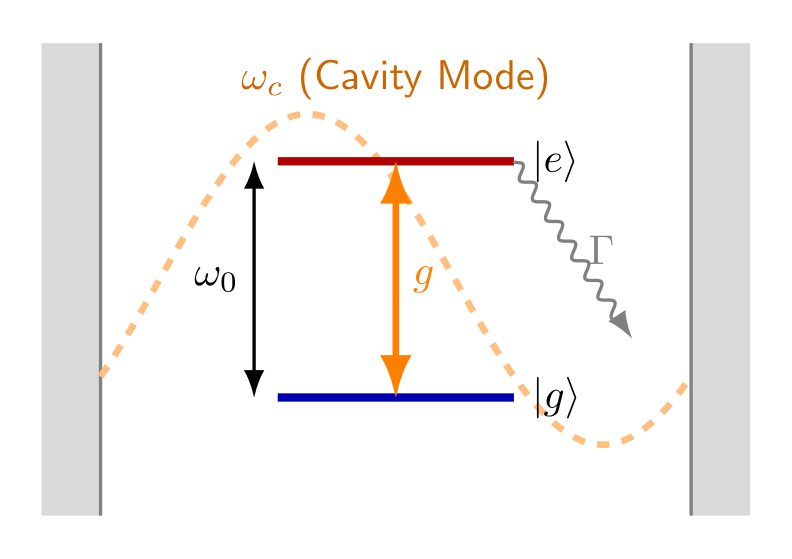
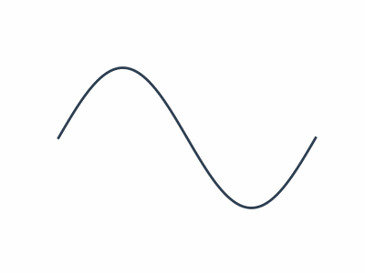

# Hassan Theme Demo
## Complete Feature Showcase

---

[Slide Layouts](#footer)

# Basic Split Layout
**`` - Text Left, Image Right**

*   This is the default 2-column layout.
*   Text automatically goes to the left.
*   Images automatically go to the right.
*   Perfect for explanatory slides.

---

[Split Reverse](#footer-left)

# Split Reverse Layout
**`` - Image Left, Text Right**

*   This flips the standard layout.
*   Image now goes to the left.
*   Text flows to the right.
*   Great for visual variety.

---

[3-Column Grid](#footer-center)

# Three Column Grid
**``**

> **Column 1**
> First column content with detailed information.

> **Column 2**
> Second column with more content.

> **Column 3**
> Third column completing the layout.

---

[2x2 Grid](#footer)

# 2x2 Grid Layout
**`` - 4 Equal Boxes**

> **Q1 - Top Left**
> First quadrant content.

> **Q2 - Top Right**
> Second quadrant content.

> **Q3 - Bottom Left**
> Third quadrant content.

> **Q4 - Bottom Right**
> Fourth quadrant content.

---

[1-2 Pattern](#footer-left)

# 1-2 Pattern Layout
**`` - Header Row, Then 2 Columns**

> **Introduction (Full Width)**
> This block automatically spans both columns below.

> **Left Column**
> Detailed content here.

> **Right Column**
> More details here.

---

[Modular Flex](#footer-center)

# Modular Flex System
**`` + `#w-XX` on each item**

> **[Full Width Header](#w-100)**
> This item is 100% width.

> **[Half Width](#w-50)**
> 50% width item.

> **[Half Width](#w-50)**
> Another 50% item.

> **[Third Width](#w-33)**
> 33% width.

> **[Third Width](#w-33)**
> 33% width.

> **[Third Width](#w-33)**
> 33% width.

---

[Semantic Boxes](#footer)

# Semantic Box Types
**Smart Tags for Colored Callout Boxes**

> **[Theorem 1](#box-theorem)**
> Blue box for theorems and propositions.

> **[Definition](#box-def)**
> Green box for definitions.

> **[Warning](#box-alert)**
> Red box for alerts and important notes.

---

[Text Styling](#footer-left)

# Text Colors and Sizes
**Smart Tags for Typography**

**Colors:**
*   This is **[Red Text](#color-red)**.
*   This is **[Blue Text](#color-blue)**.
*   This is **[Green Text](#color-green)**.
*   This is **[Purple Text](#color-purple)**.
*   This is **[Grey Text](#color-grey)**.

**Sizes:**
*   [Tiny Text](#font-tiny)
*   [Small Text](#font-small)
*   [Large Text](#font-large)
*   [Huge Text](#font-huge)

---

[Graphics Sizing](#footer-center)

# Graphics Sizing
**`` for Any Percentage**

*   `#graphics-50` = 50% width
*   Supports 1-100% sizes
*   **Semantic aliases:**
    *   `#img-tiny` = 20%
    *   `#img-small` = 40%
    *   `#img-medium` = 60%
    *   `#img-large` = 80%

---

[GIF Support](#footer-left)

# Animated GIF Support
**GIFs work with all sizing tags!**

*   Use same syntax as images
*   ``
*   Supports all `#graphics-XX` sizes
*   Animations play automatically

---

[Head Center](#footer)

# This Title is Centered
**``**

The title above is centered using the `#head-center` tag.
Useful for section dividers and announcements.

---

[Head Hide Demo](#footer-left)

**This Slide Has No Visible Title!**
**`` - Title is Hidden**

The H1 title is completely hidden on this slide.
Content starts at the top of the slide.
Great for full-screen content or quotes.

---

[Math Support](#footer)

# KaTeX Math Support
**Full LaTeX Math Rendering**

*   Inline math: $E = mc^2$
*   Display math:

$$
\boxed{\hat{H} = \hbar\omega\left(a^\dagger a + \frac{1}{2}\right)}
$$

> **[Theorem](#box-theorem)**
> The eigenvalues are $E_n = \hbar\omega(n + 1/2)$

---

[Compact Mode](#footer-left)

# Compact Mode Demo
**`#compact` - Fits More Content**

> **[Item A](#w-50)**
> Reduced padding.

> **[Item B](#w-50)**
> Smaller fonts (22px).

> **[Item C](#w-33)**
> Third width.

> **[Item D](#w-33)**
> Third width.

> **[Item E](#w-33)**
> Third width.

> **[Footer](#w-100)**
> All fits on one slide!

---

[Dense Mode](#footer-center)

# Dense Mode Demo
**`#dense` - Maximum Content**

> **[A](#w-25)**
> 25%

> **[B](#w-25)**
> 25%

> **[C](#w-25)**
> 25%

> **[D](#w-25)**
> 25%

> **[E](#w-20)**
> 20%

> **[F](#w-20)**
> 20%

> **[G](#w-20)**
> 20%

> **[H](#w-20)**
> 20%

> **[I](#w-20)**
> 20%

---

[Custom 2-3-1](#footer)

# Custom Pattern: 2-3-1
**Build ANY layout with #w-XX tags**

> **[Left Half](#w-50)**
> Row 1, Column 1.

> **[Right Half](#w-50)**
> Row 1, Column 2.

> **[Third A](#w-33)**
> Row 2, Column 1.

> **[Third B](#w-33)**
> Row 2, Column 2.

> **[Third C](#w-33)**
> Row 2, Column 3.

> **[Full Footer](#w-100)**
> Row 3 - spans everything.

---

[Multi-Tag Composition](#footer-center)

# Combining Multiple Tags
**`[Text](#tag1#tag2)` Syntax**

> **[Big Blue Theorem](#box-theorem#font-large)**
> Tags can be combined for complex styling.

> **[Red Alert](#box-alert#color-red)**
> Multiple tags work together.

*   Slide-level: ``
*   Item-level: `[Text](#color-red#font-huge)`

---

[Footer Positions](#footer-center)

# Footer Positioning
**Three Footer Placement Options**

| Tag | Position |
|-----|----------|
| `[Text](#footer)` | Right (default) |
| `[Text](#footer-left)` | Left |
| `[Text](#footer-center)` | Center |

This slide uses `#footer-center`.

---

[Summary](#footer-center)

# Summary

| Category | Features |
|----------|----------|
| **Layouts** | split, split-rev, 3col, 4col, 5col, 2x2, 1-2, 1-3, 2-1, 3-1, flex |
| **Head** | center, right, hide, title |
| **Footer** | left, center, right |
| **Boxes** | theorem, def, alert, grey, boxed |
| **Colors** | red, blue, green, purple, grey |
| **Fonts** | tiny, small, normal, large, huge |
| **Graphics** | 1-100%, img-tiny/small/medium/large/full |
| **Flex Widths** | w-100, w-75, w-66, w-50, w-33, w-25, w-20 |
| **Overflow** | compact, dense, fit, shrink |

[End of Demo](#footer-center)

